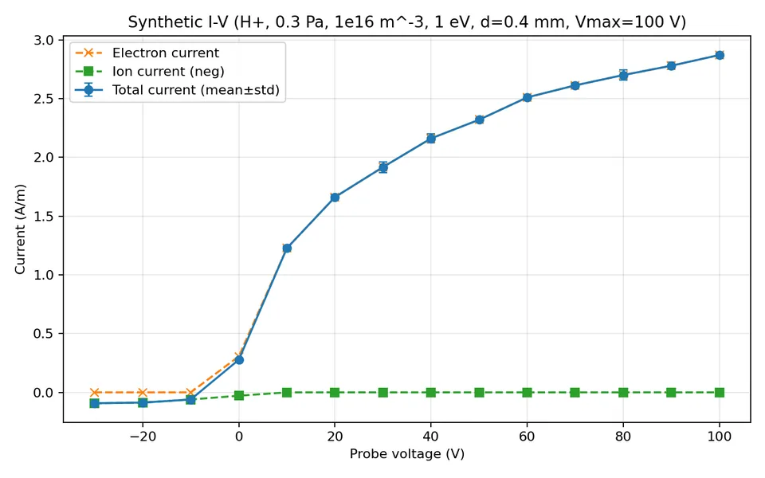
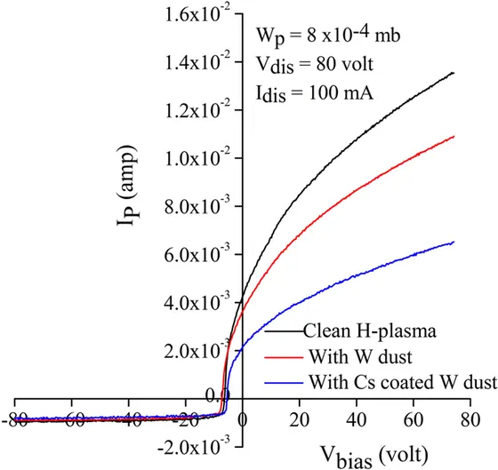

# PICSIMU（人类快速说明）

## 这是什么

PICSIMU 是一个 1D 圆柱 PIC-MCC 仿真项目，用于生成高压碰撞条件下的朗缪尔探针 I-V 曲线。
目标是产出可用于参数反演和机器学习训练的合成数据。

## 当前测试口径

- 氢等离子体
- 压力：0.3 Pa
- 密度：`1e16 m^-3`
- 电子温度：`1 eV`
- 探针直径：`0.4 mm`

## 能做什么

- 扫描探针偏压，生成 I-V 曲线（总电流/电子/离子）
- 输出电势与密度等诊断结果
- 进行多次重复仿真并取均值，降低随机波动
- 支持使用截面数据文件（`CS.txt`）

## 目录说明

- `core/`：物理与数值核心
- `frontend/`：可视化前端（Streamlit）
- `benchmarks.py`：基准入口
- `run_physics_accurate.py`：测试/数据生成入口
- `results/test_runs/`：测试输出目录

## 快速运行

```powershell
python run_physics_accurate.py
```

如果你用前端：

```powershell
streamlit run frontend/app.py
```

## 输出文件

I-V 数据保存到 `results/test_runs/`，采用时间戳命名，例如：

- `iv_curve_20260310_110921.csv`

## 测试结果与 2017 论文对比

本次对比基于：

- 仿真数据：`results/test_runs/iv_curve_20260310_110921.csv`
- 实验论文：Kakati et al., *Scientific Reports* 7, 490 (2017)

同口径关键参数：

| 项目 | 本次仿真 | 2017 论文（clean plasma） |
|---|---|---|
| 压力 | 0.3 Pa | 约 0.04-0.2 Pa |
| 探针直径 | 0.4 mm | 0.15 mm |
| 探针长度 | 1 m（按 A/m 记） | 10 mm |
| `n_e` | 设定 `1e16 m^-3` | 约 `1e16` 到 `4.5e16 m^-3` |
| `T_e` | 设定 1 eV | 约 0.6-1.2 eV |

选取 `+80 V` 对比点：

- 论文图上电流读数约 `13.5 mA`（读图估计）
- 按探针直径归一化到 0.4 mm：  
  `13.5 mA * (0.4 / 0.15) = 36.0 mA`
- 再按论文探针长度 10 mm 换算：`3.6 A/m`
- 仿真在 `+80 V` 的电流：`2.700 A/m`
- 归一化后相对差异：约 `25%`

图像对照（压缩后内联）：

- 仿真 I-V 图（压缩版，WEBP，约 23 KB）



- 2017 论文图（压缩版，WEBP，约 21 KB）



结论（当前口径）：

- I-V 形状与量级已达到一阶一致；
- 仍存在约 25% 差异，主要受探针尺寸、压力区间、读图误差与模型简化影响。

## 如何看“是否靠谱”

- 先看基准项是否通过（Poisson、温度、OML、碰撞阻尼）
- 再看与实验口径是否一致（压力、探针尺寸、`n_e`、`T_e`、I-V 区间）
- 最后对比归一化结果，避免直接比绝对电流

对照说明文档：`results/simulation_comparison_note.md`

## 文档分工

仓库仅保留两份 README（均为中文）：

- `README.md`：Agent 技术文档（详细）
- `README_HUMAN.md`：人类快速说明（本文件）
