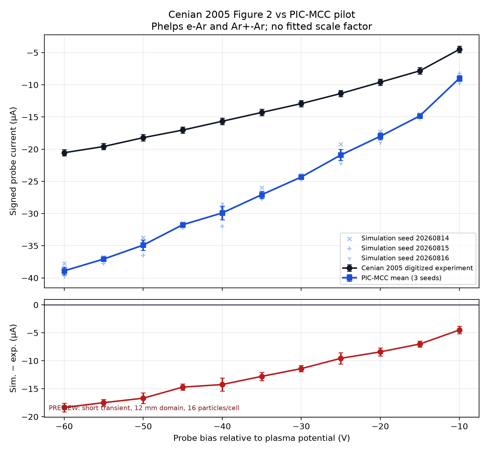

# Cenian 2005 Phelps pilot result

## Decision

This result is a **research preview that does not match the experiment**. It is not a production validation result.

The simulation used signed, unscaled current. No diameter factor, fitted scale factor, or sign reversal was applied. Across all 11 bias points, the simulated ion-branch current magnitude is 84.2% to 99.9% higher than the digitized experiment.

## Inputs

| Item | Value |
|---|---:|
| Experiment | Cenian et al., J. Appl. Phys. 97, 123310 (2005), Figure 2 |
| DOI | `10.1063/1.1938275` |
| Gas and ion | Ar and Ar+ |
| Electron and ion cross sections | Phelps, LXCat retrieval dated 2026-08-14 |
| Probe radius and length | `313 µm`, `47 mm` |
| Pressure | `1.3 mTorr` |
| Electron density | `7.15e13 m^-3` |
| Electron temperature | `1.9 eV` |
| Ion temperature | `0.025 eV` |
| Radial cells | `64` |
| Nominal particles | `1024` (`16` per cell on average) |
| Time step | `30 ps` |
| Outer radius | `12 mm` |
| Seeds | `20260814`, `20260815`, `20260816` |
| Warmup per run | `31,708` steps, `0.0200005` ion-transit time |
| Sampling per run | `31,708` steps, `0.0200005` ion-transit time |

## Direct comparison

Currents and residuals are in microamperes. Residual is simulation minus experiment.

| Bias V | Experiment µA | Simulation mean µA | Between-seed SEM µA | Residual µA | Relative error |
|---:|---:|---:|---:|---:|---:|
| -60 | -20.550 | -38.899 | 0.601 | -18.349 | -89.29% |
| -55 | -19.580 | -37.066 | 0.333 | -17.486 | -89.31% |
| -50 | -18.210 | -34.901 | 0.820 | -16.691 | -91.66% |
| -45 | -17.030 | -31.735 | 0.250 | -14.705 | -86.35% |
| -40 | -15.660 | -29.903 | 1.063 | -14.243 | -90.95% |
| -35 | -14.290 | -27.071 | 0.546 | -12.781 | -89.44% |
| -30 | -12.920 | -24.322 | 0.220 | -11.402 | -88.25% |
| -25 | -11.350 | -20.907 | 0.882 | -9.557 | -84.20% |
| -20 | -9.590 | -17.992 | 0.520 | -8.402 | -87.61% |
| -15 | -7.830 | -14.827 | 0.220 | -6.997 | -89.36% |
| -10 | -4.500 | -8.996 | 0.433 | -4.496 | -99.91% |

## Summary metrics

| Metric | Value |
|---|---:|
| Mean bias | `-12.282605 µA` |
| Mean absolute error | `12.282605 µA` |
| Root mean square error | `13.019556 µA` |
| Normalized RMSE | `0.891511` |
| Mean absolute relative error | `0.896657` |
| Maximum absolute error | `18.348840 µA` |
| Points within the stored combined 2-sigma interval | `0 / 11` |

The stored multi-seed standard error uses the between-seed estimate. Three seeds are too few for a final uncertainty estimate. Using the more conservative internal run errors still leaves every point outside two standard deviations, so this choice does not change the mismatch conclusion.

## Numerical audit

- `33 / 33` simulation runs have `READY` status.
- `33 / 33` numerical diagnostics have `PASS` status.
- Electron and ion particle-ledger residuals are zero in every run.
- Electron and ion energy-table overflow counts are zero in every run.
- No stability or runtime warning was recorded.
- All three seed curves, their mean, and the experiment curve are monotonic.
- The largest three-seed spread is `3.498397 µA` at `-40 V`.

The clean numerical audit means that the code completed the selected short pilot as designed. It does not show that the current is steady or converged.

## Limits that prevent validation

- Warmup and sampling each cover only `0.02` ion-transit time. The ion distribution is not demonstrated to be steady.
- The `12 mm` domain is smaller than the domains used in the source model. The source used about `21.8`, `48.5`, and `66.7 mm` at `-10`, `-30`, and `-50 V`.
- The conservative accelerated-electron CFL value is `0.7666`. This passes the preview limit but exceeds the recommended production limit of `0.5`.
- There are only about 16 nominal particles per cell. The first cylindrical cell has about one nominal particle under a uniform-density estimate.
- The source reports significant finite probe-length effects above `50 V` magnitude. The present infinite-cylinder model cannot validate the `-55 V` and `-60 V` points.
- The experiment obtained density and temperature from the same probe characteristic. This is not a blind validation.
- The experiment curve has one digitization and no reported point-by-point system uncertainty.
- The paper cites a 1997 Phelps electron table. The 2026 LXCat retrieval has not been shown to be numerically identical.
- This run started before the runner added Git commit and dirty-tree records. Its manifest therefore has `source_commit=null`. The exact run-start experiment provenance is preserved as `input_provenance_at_run.json`, whose hash matches the result manifest.

## Files

- `simulation_points.csv`: 33 individual seed and bias results.
- `comparison.csv`: 11 experiment and three-seed mean comparisons.
- `metrics.json`: stored summary metrics.
- `manifest.json`: run settings, input hashes, 33 numerical traces, and output hashes.
- `input_provenance_at_run.json`: exact experiment provenance snapshot used at run start.
- `comparison_plot.png`: direct signed-current comparison and residual plot.

The result files remain `PREVIEW`, and the release decision remains `NOT_EVALUATED_RESEARCH_PREVIEW`.
