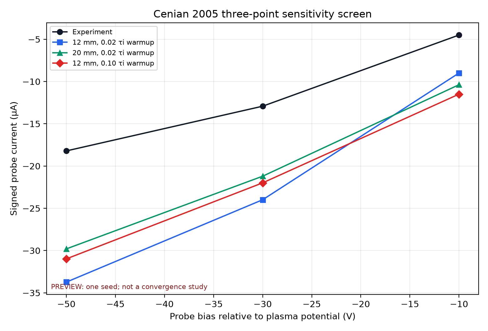

# Cenian 2005 three-point sensitivity screen

## Decision

Neither the 20 mm domain nor the longer warmup uniformly moves the current toward the experiment. Neither change explains the approximately 1.9-fold baseline magnitude.

This is a direction screen, not a convergence study. All runs use seed `20260814`, `dt=30 ps`, Phelps e-Ar and Ar+-Ar data, and the signed, unscaled current.

## Results

`D` and `T` are positive when the current magnitude decreases from the 12 mm short-warmup baseline.

| Bias V | Experiment µA | Baseline µA | 20 mm domain µA | Long warmup µA | D | T |
|---:|---:|---:|---:|---:|---:|---:|
| -50 | -18.210 | -33.735 | -29.803 | -30.986 | 11.65% | 8.15% |
| -30 | -12.920 | -23.989 | -21.203 | -21.990 | 11.61% | 8.33% |
| -10 | -4.500 | -8.996 | -10.379 | -11.495 | -15.38% | -27.78% |

At `-50 V` and `-30 V`, the 20 mm domain reduces the baseline magnitude by about 11.6%, and the longer warmup reduces it by about 8.2%. The remaining current magnitude is still 64% to 70% above the experiment.

At `-10 V`, both changes move away from the experiment. The domain result is 131% high, and the long-warmup result is 155% high.

## Interpretation

- Domain truncation contributes at the two larger bias magnitudes, but 20 mm is not a converged domain and cannot explain the full offset.
- Extending warmup from `0.02` to `0.10` ion-transit time changes the result, but it does not create a uniform move toward the experiment.
- The bias-dependent sign change means that a single empirical current scale factor would hide a model problem.
- The next audit should focus on the plasma-reservoir boundary, initial ion density and velocity consistency, current normalization, and effective probe length.
- After those checks, run a combined large-domain and long-warmup case at `-30 V`, then perform independent `dt`, grid, particle, domain, and time convergence.

All six new runs have `READY/PASS` status, zero particle-ledger residuals, zero energy-table overflow, and no runtime or stability warning.
